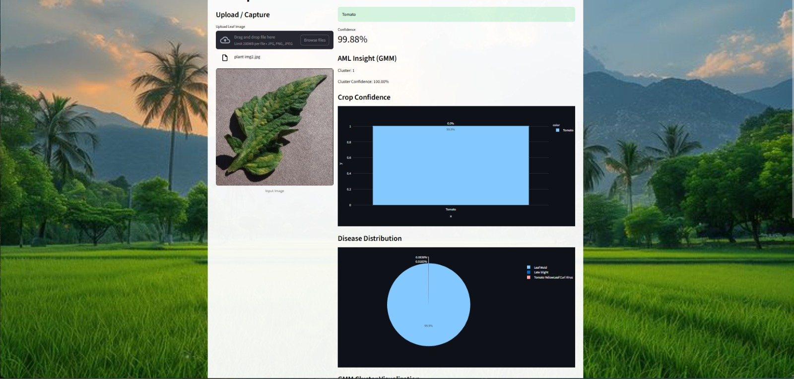

# 🌿 AI Crop Doctor — Plant Disease Detection

A deep learning web app that detects plant diseases from leaf images using a CNN (MobileNetV2) combined with Gaussian Mixture Model (GMM) clustering for advanced pattern analysis.



---

## Features

- Upload a leaf image or capture one via webcam
- CNN-based disease classification across 15 classes
- Confidence score with top-3 prediction bar chart
- GMM clustering for unsupervised feature analysis with PCA visualization
- Disease cause, precaution, and fertilizer recommendations

---

## Tech Stack

| Layer | Tools |
|---|---|
| Frontend | Streamlit |
| Deep Learning | TensorFlow / Keras, MobileNetV2 |
| Advanced ML | Scikit-learn (GMM, PCA) |
| Visualization | Plotly, Matplotlib, Seaborn |
| Image Processing | Pillow (PIL), NumPy |

---

## Supported Classes

Covers 15 disease/healthy categories across 3 crops:

- **Pepper Bell** — Bacterial Spot, Healthy
- **Potato** — Early Blight, Late Blight, Healthy
- **Tomato** — Bacterial Spot, Early Blight, Late Blight, Leaf Mold, Septoria Leaf Spot, Spider Mites, Target Spot, Mosaic Virus, YellowLeaf Curl Virus, Healthy

---

## Project Structure

```
├── app.py                      # Streamlit web app
├── training/
│   └── train_model.py          # CNN training + GMM fitting
├── model/
│   ├── plant_disease_model.h5  # Trained CNN model
│   └── gmm_model.pkl           # Trained GMM model
├── dataset/
│   └── PlantVillage/           # Training images (per-class folders)
├── static/
│   └── background.jpeg         # App background
├── evaluation_metrics_graph.py # Generates evaluation heatmap
├── model_training_graph.py     # Generates accuracy/loss plots
├── report_assets/              # Saved graphs and screenshots
└── requirements.txt
```

---

## Setup & Run

1. Clone the repo and install dependencies:

```bash
pip install -r requirements.txt
```

2. Train the model (skip if using pre-trained models in `model/`):

```bash
python training/train_model.py
```

3. Launch the app:

```bash
streamlit run app.py
```

---

## Model Architecture

- Base: **MobileNetV2** pretrained on ImageNet
- Custom head: GlobalAveragePooling → Dropout(0.3) → Dense(15, softmax)
- Training: 2-stage — frozen base (5 epochs) then fine-tune last 30 layers (10 epochs)
- Input size: 224×224 RGB
- GMM: fitted on CNN penultimate-layer features, 2 components

---

## Evaluation

Run the evaluation script to generate a classification report heatmap:

```bash
python evaluation_metrics_graph.py
```

Training accuracy/loss curves:

```bash
python model_training_graph.py
```

---

## Dataset

[PlantVillage Dataset](https://github.com/spMohanty/PlantVillage-Dataset) — open-source collection of labeled plant leaf images across multiple crops and disease categories.
